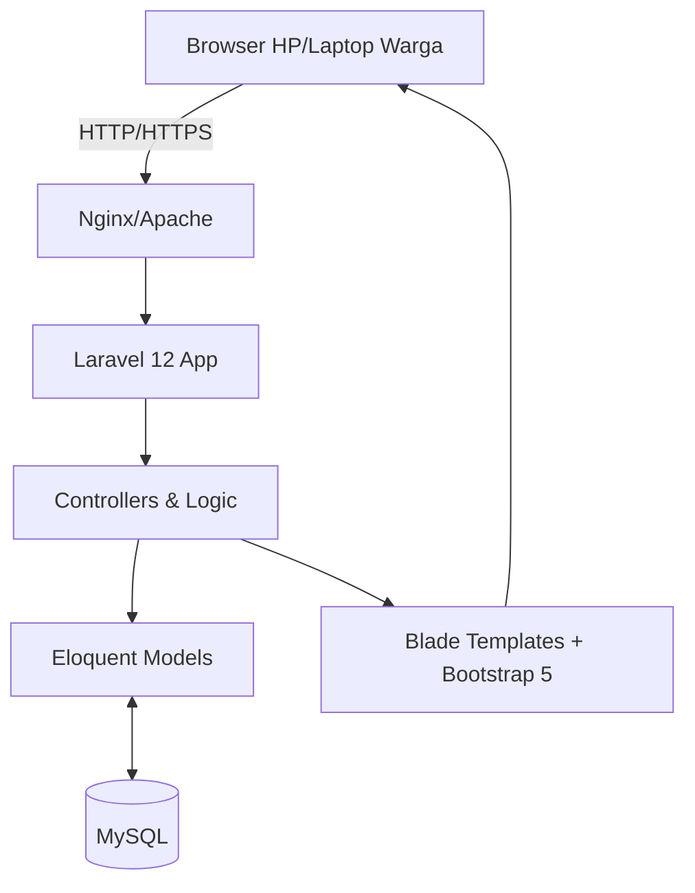

# PERENCANAAN PROYEK: Sistem Informasi Pengaduan Masyarakat (SIM-PENGADUAN)
**Lokasi Implementasi:** Kelurahan Sunyaragi, Jl. Brigjend Darsono No.1 (Bypass), Kec. Kesambi, Kota Cirebon, Jawa Barat 45132  
**Teknologi Utama:** Laravel 12, MySQL, Bootstrap 5 (Mobile-First)

---

## 1. PROJECT OVERVIEW

**Latar Belakang**
Masyarakat Kelurahan Sunyaragi membutuhkan saluran komunikasi yang cepat, transparan, dan mudah diakses untuk menyampaikan aspirasi dan keluhan. Proses pengaduan manual atau melalui platform perpesanan standar (seperti WhatsApp) seringkali menyulitkan pelacakan status, tidak terpusat, dan menyulitkan pihak kelurahan dalam merekapitulasi data untuk pengambilan keputusan.

**Permasalahan Utama**
1. Tidak ada sistem pelacakan tiket (ticket tracking) untuk keluhan masyarakat.
2. Data pengaduan tersebar dan tidak terstruktur, menyulitkan pembuatan laporan bulanan.
3. Respons terhadap keluhan lambat karena tidak ada sistem notifikasi dan eskalasi terpusat.

**Tujuan Proyek (SMART)**
- **Specific:** Membangun aplikasi web pengaduan masyarakat berbasis Laravel 12 dan Bootstrap 5 dengan fitur frontend (pelapor) dan backend (admin/petugas).
- **Measurable:** Mengurangi waktu respons awal keluhan menjadi maksimal 24 jam dan mendigitalkan 100% rekap laporan.
- **Achievable:** Menggunakan resource internal/vendor dengan teknologi open-source yang stabil.
- **Relevant:** Meningkatkan indeks kepuasan pelayanan masyarakat di Kelurahan Sunyaragi.
- **Time-bound:** Proyek diselesaikan dan siap *Go-Live* dalam waktu 3 minggu (21 hari).

**Ruang Lingkup (Scope)**
- **In-Scope:** Registrasi/Login (Masyarakat & Petugas), Form Pengaduan (Foto, Lokasi, Kategori), Tracking Status Pengaduan, Dashboard Analitik Admin, Laporan PDF/Excel, Responsive Mobile-First Design.
- **Out-Scope:** Aplikasi Mobile Native (Android/iOS) di luar lingkup, integrasi langsung dengan Command Center Pemkot Cirebon (tahap 2).

---

## 2. STAKEHOLDER ANALYSIS

| Stakeholder | Peran & Tanggung Jawab | Kepentingan (Interest) | Kekuasaan (Power) | Strategi Komunikasi |
| :--- | :--- | :--- | :--- | :--- |
| **Lurah Sunyaragi** | Project Sponsor, Pengambil Keputusan | Tinggi | Tinggi | Manage Closely (Laporan progres mingguan) |
| **Petugas Kelurahan** | System Admin/Verifikator | Tinggi | Sedang | Keep Satisfied (Pelatihan teknis & UAT) |
| **Masyarakat Sunyaragi** | End-User (Pelapor) | Tinggi | Rendah | Keep Informed (Sosialisasi & panduan) |
| **Tim Pengembang (IT)** | Eksekutor Proyek | Sedang | Tinggi | Manage Closely (Daily standup, sprint review) |

---

## 3. REQUIREMENT ANALYSIS

**Functional Requirements**
- Sistem harus memungkinkan warga mendaftar menggunakan NIK.
- Warga dapat membuat pengaduan dengan melampirkan foto bukti, kategori, dan deskripsi.
- Petugas dapat memverifikasi, mengubah status (Menunggu, Diproses, Selesai, Ditolak), dan memberikan tanggapan.
- Admin memiliki Dashboard interaktif (Total Pengaduan, Grafik Kategori, Pengaduan Selesai).

**Non-Functional Requirements**
- **UI/UX:** Mobile-first menggunakan Bootstrap 5 terbaru, desain responsif, load time di bawah 3 detik.
- **Security:** Proteksi CSRF, XSS, SQL Injection (bawaan Laravel), password di-hash dengan Bcrypt.
- **Availability:** Uptime sistem 99%.

**Use Case Diagram (Konseptual)**
```mermaid
usecaseDiagram
    actor Masyarakat
    actor Petugas
    actor Admin
    
    Masyarakat --> (Registrasi / Login)
    Masyarakat --> (Buat Pengaduan)
    Masyarakat --> (Lacak Status)
    
    Petugas --> (Verifikasi Pengaduan)
    Petugas --> (Update Status & Tanggapan)
    
    Admin --> (Manajemen User)
    Admin --> (Lihat Dashboard)
    Admin --> (Generate Laporan)
```

---

## 4. SOLUSI & PENDEKATAN

**Alternatif Solusi:**
1. Penggunaan Google Form & Spreadsheet (Murah, namun tidak ada fitur tracking dan dashboard yang proper).
2. Pengembangan Aplikasi Web Kustom dengan Laravel 12 (Solusi optimal, skalabel, memiliki ekosistem yang matang).

**Solusi Terpilih:** **Pengembangan Web App Laravel 12 + Bootstrap 5**
*Alasan:* Laravel memberikan struktur MVC yang aman, ORM Eloquent yang kuat untuk MySQL, dan blade templating yang mudah diintegrasikan dengan Bootstrap 5. Pendekatan *Mobile-First* menjamin aksesibilitas maksimal karena mayoritas warga mengakses via smartphone.

**Arsitektur Solusi:**


---

## 5. WORK BREAKDOWN STRUCTURE (WBS)

| WBS Code | Nama Pekerjaan (Task) | Output / Deliverable |
| :--- | :--- | :--- |
| **1.0** | **Initiation & Planning** | |
| 1.1 | Requirement Gathering dengan Kelurahan | SRS (Software Requirement Spec) |
| 1.2 | Penyusunan Project Plan & WBS | Project Plan Document |
| **2.0** | **Design (UI/UX & DB)** | |
| 2.1 | Wireframing & Prototyping (Figma) | Mockup UI (Mobile & Desktop) |
| 2.2 | Perancangan Database & ERD | Skema Database MySQL |
| **3.0** | **Development (Coding)** | |
| 3.1 | Setup Environment Laravel 12 | Repository & Boilerplate |
| 3.2 | Modul Autentikasi & Role Management | Fitur Login/Register/Role |
| 3.3 | Modul Frontend (Halaman Masyarakat) | Halaman Landing, Form Pengaduan |
| 3.4 | Modul Backend (Halaman Petugas) | List Verifikasi, Update Status |
| 3.5 | Modul Dashboard & Reporting | Grafik Statistik, Export PDF/Excel |
| **4.0** | **Testing & QA** | |
| 4.1 | Unit & Integration Testing | Laporan Testing Internal |
| 4.2 | User Acceptance Testing (UAT) | Berita Acara UAT |
| **5.0** | **Deployment & Handover** | |
| 5.1 | Setup Server & Domain Kelurahan | Sistem Live di Production |
| 5.2 | Pelatihan Petugas Kelurahan | User Manual, Video Tutorial |

---

## 6. TIMELINE & SCHEDULING

Proyek akan dijalankan dalam durasi **3 Minggu** (21 Hari).

| Fase / Section | Nama Pekerjaan (Task) | Durasi | Ketergantungan |
| :--- | :--- | :--- | :--- |
| **1. Planning** | Requirement Gathering | 1 Hari | - |
| | Project Planning | 1 Hari | Setelah Requirement Gathering |
| **2. Design** | UI/UX Design & Figma | 2 Hari | Setelah Project Planning |
| | Database Design & ERD | 1 Hari | Setelah Project Planning |
| **3. Development** | Setup Environment & Auth | 2 Hari | Setelah UI/UX Design |
| | Modul Frontend (Warga) | 4 Hari | Setelah Setup & Auth |
| | Modul Backend (Petugas) | 3 Hari | Setelah Modul Frontend |
| | Dashboard & Report | 2 Hari | Setelah Modul Backend |
| **4. Testing** | QA & Bug Fixing | 2 Hari | Setelah Dashboard & Report |
| | UAT dengan Kelurahan | 1 Hari | Setelah QA & Bug Fixing |
| **5. Deployment** | Deployment & Go-Live | 1 Hari | Setelah UAT |
| | Training Petugas | 1 Hari | Setelah Deployment |

---

## 7. RESOURCE PLANNING

**Sumber Daya Manusia (SDM):**
- **Project Manager / System Analyst (1x):** Memimpin proyek, komunikasi dengan kelurahan.
- **UI/UX Designer (1x):** Membuat desain responsif dengan Bootstrap 5 *guideline*.
- **Fullstack Laravel Developer (2x):** Implementasi frontend & backend.
- **QA Tester (1x):** Memastikan tidak ada *bug* sebelum UAT.

**Tools & Teknologi:**
- **Code:** Laravel 12, PHP 8.2+, MySQL, Bootstrap 5.3, JavaScript (Alpine.js/Vanilla).
- **Project Management:** Trello / Jira.
- **Version Control:** Git & GitHub/GitLab.

---

## 8. RISK MANAGEMENT

| Risiko (Risk) | Probabilitas | Dampak | Strategi Mitigasi |
| :--- | :--- | :--- | :--- |
| **Warga enggan memakai aplikasi** | Sedang | Tinggi | Sosialisasi gencar di tingkat RT/RW, desain UI dibuat semudah mungkin (mirip sosmed). |
| **Data NIK warga bocor/disalahgunakan** | Rendah | Sangat Tinggi | Enkripsi data sensitif di DB, gunakan HTTPS, akses ketat berdasarkan *Role* (RBAC). |
| **Server down akibat lonjakan akses** | Rendah | Sedang | Hosting menggunakan Cloud VPS yang skalabel, optimasi query N+1 di Laravel. |
| **Keterlambatan approval dari Kelurahan** | Sedang | Sedang | Tetapkan SLA review desain & UAT dalam kontrak proyek. |

---

## 9. QUALITY PLAN

- **Standar Kode:** Mengikuti PSR-12, menggunakan Laravel *Form Requests* untuk validasi data yang ketat.
- **Standar UI:** Lulus uji *Google Mobile-Friendly Test* dan *Lighthouse Accessibility Score* > 90.
- **KPI Keberhasilan Proyek:**
  - Proyek selesai tepat waktu (3 minggu) dan *on-budget*.
  - Tingkat adopsi: Minimal 50 pengaduan masuk melalui sistem pada bulan pertama peluncuran.
  - Zero critical bugs saat *Go-Live*.

---

## 10. IMPLEMENTATION STRATEGY

**Metodologi: Agile Scrum Framework**
- **Sprint Length:** 1 Minggu per Sprint (Total 3 Sprint).
- **Sprint 1 (Minggu 1):** Planning, UI/UX Design, DB Design, Setup Auth & Modul Frontend (Warga).
- **Sprint 2 (Minggu 2):** Modul Backend (Petugas), Dashboard Admin, dan Reporting.
- **Sprint 3 (Minggu 3):** QA, Bug Fixing, UAT, Deployment, dan Training Petugas.

---

## 11. MONITORING & EVALUATION

- **Daily Standup:** Tim internal IT selama 10 menit (progres, blocker).
- **Sprint Review (Dwi-mingguan):** Demo fitur yang sudah selesai kepada Lurah/Petugas untuk mendapatkan *feedback* cepat.
- **Post-Implementation Review:** Evaluasi 1 bulan setelah *Go-Live* untuk mengukur efektivitas sistem (waktu respons kelurahan vs target SLA).

---

## 12. DELIVERABLES

1. **Dokumen Perancangan:** Software Requirements Specification (SRS) & ERD.
2. **Desain Sistem:** Link prototype Figma.
3. **Source Code:** Repository Git lengkap.
4. **Sistem Live:** Aplikasi dapat diakses di domain resmi kelurahan (contoh: *pengaduan.sunyaragi.desa.id*).
5. **Dokumentasi Pengguna:** User Manual (PDF) dan Video Tutorial untuk warga dan petugas kelurahan.

---

## 13. BONUS: STRATEGI AI & BEST PRACTICES MODERN

Untuk menjadikan sistem ini berstandar "Smart City", berikut integrasi dan rekomendasi tingkat lanjut:

### 🌟 Integrasi AI/Automation (Dapat disisipkan di Fase 2)
1. **Auto-Categorization (NLP):** Saat warga mengetikkan keluhan (misal: "Jalan berlubang di depan masjid"), AI (menggunakan OpenAI API / Gemini API) secara otomatis mengklasifikasikan ini ke kategori "Infrastruktur" dan memberikan prioritas "High".
2. **Sentiment Analysis:** Menganalisis sentimen deskripsi keluhan masyarakat. Dashboard admin akan menyorot (highlight) laporan dengan sentimen "Sangat Marah/Frustrasi" agar ditangani lebih cepat untuk meredam eskalasi konflik di masyarakat.
3. **Smart Auto-Reply:** Memberikan respons instan berbasis rule/AI: "Terima kasih, laporan terkait [Kategori] di [Lokasi] telah kami terima. Rata-rata waktu penyelesaian untuk kasus ini adalah 2 hari."

### 🚀 Rekomendasi Tools Digital Modern
- **Laravel Pulse / Telescope:** Untuk memonitor performa aplikasi, slow queries, dan error log secara real-time di sisi server.
- **Pusher / Laravel Reverb:** Untuk memberikan notifikasi *real-time* kepada admin saat ada laporan baru tanpa harus me-refresh halaman (WebSocket).
- **Spatie Media Library:** Untuk pengelolaan unggahan foto keluhan yang efisien dan rapi (otomatis kompresi gambar agar server tidak cepat penuh).

### 💡 Insight Strategis (Best Practice)
- **Gamifikasi Masyarakat:** Berikan *badge* atau poin bagi warga yang aktif melaporkan fasilitas rusak secara valid (misal: Warga Peduli Lingkungan). Ini meningkatkan *engagement*.
- **Transparansi Publik:** Tampilkan ringkasan statistik di halaman depan (Landing Page) yang dapat dilihat semua orang (contoh: "Bulan ini: 120 Keluhan Selesai, 5 Diproses"). Ini akan sangat membangun kepercayaan publik terhadap kinerja Kelurahan Sunyaragi.
