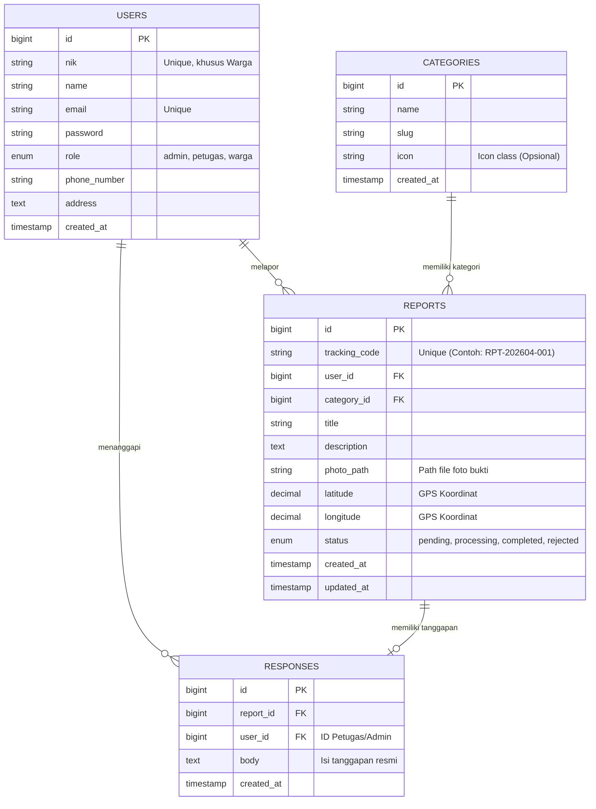

# DOKUMEN RENCANA DESAIN (SIM-PENGADUAN)
**Fase 2: UI/UX & Database Design**

Dokumen ini memuat rancangan dasar arsitektur antarmuka (UI/UX) dan struktur basis data (Database) yang akan digunakan untuk mengimplementasikan Sistem Informasi Pengaduan Masyarakat.

---

## 1. SKEMA DATABASE (Entity Relationship Diagram)

Sistem akan menggunakan MySQL dengan skema relasional yang berpusat pada Entitas Pengaduan (Reports). Berikut adalah rancangan ERD dalam bentuk diagram:

**Penjelasan Singkat Tabel:**
1. **`users`**: Menyimpan data autentikasi baik untuk Masyarakat (warga), Petugas Kelurahan, maupun Admin. Warga diwajibkan menggunakan NIK yang valid.
2. **`categories`**: Master data untuk kategori pengaduan (misal: Infrastruktur, Lingkungan, Pelayanan, dll).
3. **`reports`**: Tabel utama penyimpan keluhan warga, dilengkapi koordinat GPS, foto bukti, dan *Tracking Code* unik.
4. **`responses`**: Tabel relasi 1-to-1 / 1-to-M terhadap `reports` untuk menyimpan tanggapan/verifikasi resmi dari Petugas.

---

## 2. STRUKTUR NAVIGASI & SITEMAP

Pembagian akses fitur (*Role-Based Access Control*):

### A. Area Masyarakat / Publik (Warga)
- **Halaman Utama (Landing Page):** Informasi layanan, cara lapor, form cek status pengaduan (tanpa login).
- **Halaman Login / Registrasi:** Autentikasi NIK.
- **Halaman Buat Laporan:** Form keluhan (Pilih kategori, deskripsi, upload foto, ambil lokasi).
- **Halaman Riwayat Laporan:** Daftar keluhan yang pernah dikirim warga beserta status berjalannya.
- **Halaman Detail Laporan:** Lihat *progress* tiket dan tanggapan kelurahan.

### B. Area Petugas (Verifikator)
- **Dashboard Petugas:** Statistik tiket aktif yang perlu diproses hari ini.
- **Daftar Laporan Masuk:** Tabel laporan dengan filter `pending` dan `processing`.
- **Halaman Verifikasi & Tanggapan:** Form untuk mengubah status (misal dari "Pending" menjadi "Diproses" lalu "Selesai") dan memberikan jawaban ke warga.

### C. Area Admin Kelurahan
- *(Memiliki semua akses Petugas ditambah)*
- **Master Data Pengguna:** Kelola akun Warga dan Petugas.
- **Master Kategori:** Tambah/Edit/Hapus jenis kategori pengaduan.
- **Laporan & Ekspor (Reporting):** Ekspor PDF/Excel rekapan keluhan per bulan atau per kategori untuk rapat kelurahan.

---

## 3. KONSEP UI/UX & DESIGN SYSTEM (MOBILE-FIRST)

Sesuai standar modern dan *Mobile-First*, desain akan sepenuhnya di-handle oleh **Bootstrap 5.3**. 

### A. Palet Warna (Color Scheme)
- **Primary Color (`#0d6efd` - Bootstrap Blue):** Tombol aksi utama (Kirim Laporan, Login).
- **Secondary Color (`#6c757d` - Gray):** Teks sekunder, elemen pendukung.
- **Status Colors:**
  - 🟠 **Warning (`#ffc107`):** Status *Pending* (Menunggu Verifikasi).
  - 🔵 **Info (`#0dcaf0`):** Status *Processing* (Sedang Diproses).
  - 🟢 **Success (`#198754`):** Status *Completed* (Selesai).
  - 🔴 **Danger (`#dc3545`):** Status *Rejected* (Ditolak / Laporan Palsu).

### B. Tipografi (Google Fonts)
- **Font Utama:** `Inter` atau `Roboto` (Menjamin keterbacaan tinggi di layar HP warga).

### C. UI Component Guidelines (Bootstrap 5)
- **Form Input:** Menggunakan `form-floating` agar label terlihat bersih dan modern layaknya aplikasi Native.
- **Tabel Data Admin:** Menggunakan integrasi **DataTables** yang dibalut `table-responsive` agar rapi di layar kecil.
- **Alert & Notifikasi:** Menggunakan `SweetAlert2` untuk konfirmasi aksi (seperti "Apakah Anda yakin laporan ini selesai?") dan notifikasi "Laporan Berhasil Terkirim".

---

## 4. TATA LETAK WIREFRAME (LAYOUT CONCEPT)

### Layout Warga (Mobile-Centric)
* Navbar atas: Logo Kelurahan & Tombol Profil.
* Hero Section: Tulisan "Layanan Pengaduan Cepat" dengan input besar untuk **Lacak Tiket**.
* Floating Action Button (FAB): Tombol bulat merah/biru besar di pojok kanan bawah HP khusus untuk memicu "Buat Laporan Baru".

### Layout Admin / Petugas (Desktop-Centric)
* Sidebar Kiri (Offcanvas di Mobile): Menu Navigasi (Dashboard, Laporan, Master Data).
* Header Atas: Breadcrumb, Notifikasi Bel (Unread Reports), dan Profil.
* Konten Utama: Berupa *Cards* statistik di atas, dan tabel *DataTables* berukuran penuh di bawahnya.
